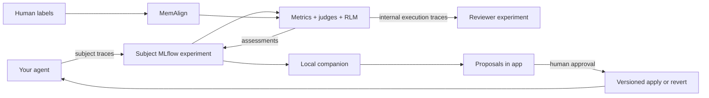

# Agent Improvement Loop

Agent Improvement Loop connects an agent's MLflow traces to an evidence-driven
improvement workflow on Databricks.

You connect an experiment, describe what should improve, and keep using the
agent. The system evaluates new traces, helps you calibrate subjective judges
with human feedback, proposes changes, and shows the evidence in an app. A local
companion applies only the changes you approve.

The core rule is simple: **missing evidence is not improvement**. The app shows
`collecting`, `untrusted`, or `not ready` until the relevant data gates are met.

## What happens after you connect an agent

1. **Connect an MLflow experiment.** Use an existing experiment, including its
   trace history, or create a new one. One subject experiment belongs to one
   registered agent.
2. **Isolate framework traces.** Onboarding creates a separate reviewer
   experiment so HALO, judge, and framework execution traces do not contaminate
   the subject agent's metrics.
3. **Choose goals.** Select built-in goals such as token efficiency, cost,
   latency, or accuracy. You can also describe custom goals in natural language.
4. **Route each goal to the right measurement.** Quantities such as duration,
   tokens, and estimated cost use deterministic metrics. Subjective behavior
   becomes a custom trace-based MemAlign judge.
5. **Evaluate new traces.** Deterministic metrics, registered judges, and the
   arrival-triggered RLM/HALO reviewer attach evidence to subject traces.
6. **Add human feedback where needed.** Quality judges remain untrusted until
   enough representative traces are labeled and judge agreement/coverage clears
   the readiness gates.
7. **Review proposals.** The local companion reads goals and trace evidence, then
   publishes concrete proposed changes into the app.
8. **Approve and apply.** Only approved companion-produced changes are applied.
   Applied versions retain provenance and can be compared or reverted.

## What is automatic—and what is not

| Behavior | What to expect |
|---|---|
| App data refresh | Query-backed data refreshes in the background without remounting the whole page or clearing active forms and tabs. |
| Deterministic metrics | Calculated from trace facts such as tokens, duration, tool calls, and pricing data. No LLM judge is used to estimate an exact number. |
| Registered judge scoring | Runs asynchronously for new traces according to the judge's sampling configuration. |
| RLM/HALO review | Triggered by updates to the configured OTEL spans table. One active run drains unreviewed traces in bounded batches; Jobs queueing is disabled. |
| MemAlign | Can align a judge only after people provide human feedback. It cannot infer your private standard without labels. |
| Proposal generation | Requires the local companion to be running on compute that can access the agent's project. |
| Applying changes | Requires human approval. The hosted app does not silently edit a local coding project. |
| Comparing versions | Requires version/configuration metadata and published comparison evidence. Merely naming two traces does not prove one version is better. |
| GEPA optimization | Runs only when a user opens Optimize, chooses a bounded budget, acknowledges the cost, and dispatches it. It is not an automatic reaction to every trace. |

### What happens when you run GEPA

The Optimize page dispatches a bounded Databricks Job. This repository uses
**GEPA Optimize Anything directly** (`gepa.optimize` with a custom adapter), not
`mlflow.genai.optimize_prompts`, because the artifact is a coding-agent skill body
and fitness is a two-arm baseline/candidate comparison that fails closed on execution
or correctness regressions.

If the evolved body wins on the held-out split, the job logs it to the reviewer
MLflow experiment and creates an Approval with the exact local diff, project-relative
target, hashes, evidence, and validation command. Approval changes it to
`approved / waiting_for_companion`; the hosted app never writes the user's computer.
The local companion downloads the approved artifact, verifies the target and hashes,
snapshots it, rewrites atomically, validates, and records lineage. Conflicts apply
nothing, and failed validation restores the original snapshot.

## Important caveats

Read these before treating the loop as fully autonomous:

| Caveat | What it means |
|---|---|
| Quality goals need human feedback | Custom quality goals start as **untrusted** MemAlign judges. Label representative traces; the default alignment floor is about 20 labels, and trust still requires agreement and scored coverage. Pure token, latency, tool-count, and cost goals are deterministic and do not inherently need labels. |
| Subject and reviewer experiments must stay separate | Assessments attach to subject traces, while RLM/judge execution traces go to the reviewer experiment. Combining them contaminates counts and can make the framework review itself. |
| RLM triggers watch physical tables | Onboarding adds a new agent's derived `*_otel_spans` table to the RLM trigger, and deployment bootstrap heals the full add-only registry list after a bundle deploy. An agent without a valid `annotations_table` is reported as underivable rather than guessed. The scan window is the newest 10,000 traces, so very large backlogs still need an explicit backfill. |
| Coding-agent versions are metadata snapshots | Claude Code and Codex are external processes, so versions use `mlflow.create_external_model(model_type="agent")`. Set `MLFLOW_ACTIVE_MODEL_ID` or call `set_active_model` to link future traces. Historical traces are not rewritten with `mlflow.modelId`. |
| The local companion must be running | Databricks continues evaluating traces if the companion stops, but local planning, proposals, and approved project edits do not progress. |
| Existing experiments can be adopted but not shared | A populated experiment can keep its trace history, but one experiment can belong to only one registry entry. Every app page is scoped by the selected entry's experiment ID. |
| Authentication is environment-specific | UC trace APIs need accepted runtime credentials. Expired local profile OAuth can break trace reads and browser smoke tests even when the deployed app is healthy. |
| GEPA currently executes Claude Code only | The hosted job packages the `claude_code` coding-agent adapter. Codex and arbitrary custom coding agents remain visible in the app, but Optimize refuses their live runs until an executable adapter is packaged. |
| GEPA cannot edit a laptop from the app | Approval records `waiting_for_companion`. A locally running companion verifies the reviewed MLflow artifact and hashes before it rewrites the configured project-relative target. |

## What recently changed

- Background polling no longer refreshes the entire UI or clears user work.
- Experiment switching now scopes all major pages and their query parameters.
- Compare and Approvals bind `experiment_id`; the previous
  `UNBOUND_SQL_PARAMETER` failures are fixed.
- Existing populated experiments can be onboarded with a separate reviewer
  experiment.
- Goal catalog and natural-language requirements are one onboarding flow.
- Custom natural-language quality goals can author MemAlign judges after an
  explicit preview/confirmation step.
- Data Gate descriptions update immediately from cached backend-authored gate
  definitions instead of waiting for another onboarding job.
- RLM moved from a five-minute cron with queued runs to a Delta table-update
  trigger with drain-until-quiet behavior.
- Compare now shows coding-agent configuration differences and MLflow external
  agent version IDs.
- Optimize now dispatches and monitors the resource-scoped GEPA Databricks Job
  without refreshing the page. A held-out winner becomes an experiment-scoped
  Approval; the local companion performs the reviewed rewrite with snapshot,
  validation, rollback, and lineage.

The detailed deployment record, live IDs, validation results, and remaining
operational checks are in
[`docs/HANDOFF_2026-07-15.md`](docs/HANDOFF_2026-07-15.md).

## Readiness states

The exact policy lives in `src/ail/readiness`; the UI renders the backend's gate
descriptions and thresholds.

| Approximate default | Meaning |
|---|---|
| 10 traces | Enough data to establish an initial deterministic baseline and diagnosis. |
| 20 human labels | Minimum label volume before a quality judge can be aligned; trust still depends on measured agreement and coverage. |
| 50 traces | Default evidence floor for proving an improvement rather than showing an early controlled result. |

These are defaults, not promises. A judge can remain distrusted after 20 labels,
and 50 traces do not override a failed correctness or readiness guardrail.

## Getting started

For the guided path:

- [`docs/QUICK_CONNECT.md`](docs/QUICK_CONNECT.md) — instrument an agent or LLM call.
- [`docs/GETTING_STARTED.md`](docs/GETTING_STARTED.md) — connect traces and walk through the loop.
- [`docs/DEPLOY.md`](docs/DEPLOY.md) — permissions, variables, bootstrap order, jobs, and app deployment.
- [`docs/PROJECT_STATE.md`](docs/PROJECT_STATE.md) — detailed capability and source map.
- [`docs/PRODUCT_ARCHITECTURE.md`](docs/PRODUCT_ARCHITECTURE.md) — architecture and trust design.

The deployment order is important:

1. Deploy the root job bundle with explicit experiment, warehouse, catalog, and
   schema variables.
2. Run `ail-bootstrap-grants` before the app build so required tables and additive
   columns exist and the monitoring warehouse is configured.
3. Deploy the AppKit app with the apply, onboarding, GEPA, monitoring-job, and
   warehouse resource IDs. The GEPA binding requires `CAN_MANAGE_RUN`.
4. Onboard the agent in the app and confirm its goals/data gates.
5. Start the local companion for planning and applying approved project changes.

Do not skip the bootstrap on an upgrade that adds SQL columns: AppKit type
generation describes live queries during the app build and fails if the live
tables have not been migrated.

## Reference deployment

- Workspace profile: `dais-demo`
- App: https://ail-self-optimizer-7474647489683936.aws.databricksapps.com
- Subject experiment: `1301765275062543`
- Reviewer experiment: `1301765275062544`
- SQL warehouse: `7d1d3dbb3ba65f2a`
- App tables: `austin_choi_omni_agent_catalog.agent_improvement_loop`
- Trace tables: `austin_choi_omni_agent_catalog.mlflow_traces`
- RLM job: `643188029858547` (`ail-continuous-rlm-trace-arrival`)
- GEPA job: `804443805571652` (`ail-gepa-optimization`, queue disabled)

## Provenance and license

The ingestion seam and core modules are original clean-room work written against
this repository's interfaces and the public APIs of MLflow, the Databricks SDK,
and the Claude Agent SDK. Licensed under Apache-2.0. See
[`PROVENANCE.md`](PROVENANCE.md) and [`NOTICE`](NOTICE).
