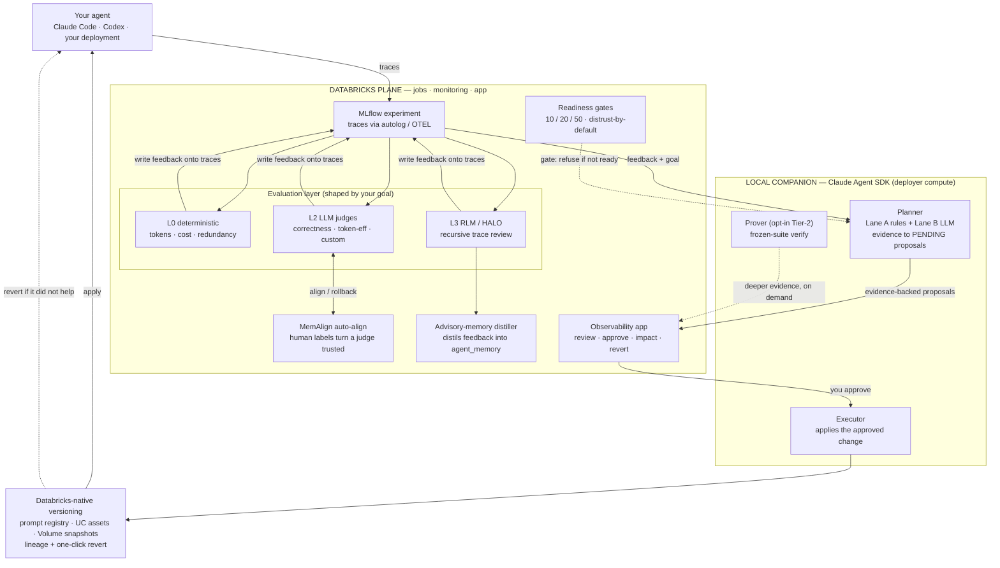

# agent-improvement-loop

A reusable, **self-deployable framework that helps LLM agents self-improve** — on
Databricks. Point it at an agent's MLflow traces, state a goal in natural language
(token efficiency, coding accuracy, cost), and it continuously **evaluates** the agent
(LLM judges + recursive RLM/HALO review + deterministic metrics), **diagnoses** the
dominant waste or failure mode, and **proposes concrete, evidence-backed improvements** —
a prompt/skill change, a new tool or metric view, a cache, or anything else an agent can
build. **You approve each change in an app; a local agent applies it (versioned and
revertible); you watch the real before/after impact.**

The load-bearing principle: **the human decides on evidence, and the system refuses to
fake improvement.** Judges are distrusted until aligned to human labels and measured
against a held-out anchor; the optimizer never trains on the frozen evaluation set; and
nothing reaches your live agent without your approval. That is what separates real
improvement from a dashboard that says "improved" while quality stalls (the
co-adaptation trap every reference loop we surveyed omits).

> **New here?**
> - [`docs/QUICK_CONNECT.md`](docs/QUICK_CONNECT.md) — wrap any Python agent or LLM call in minutes.
> - [`docs/GETTING_STARTED.md`](docs/GETTING_STARTED.md) — hands-on onboarding: connect traces, state a goal, walk the loop.
> - [`docs/PROJECT_STATE.md`](docs/PROJECT_STATE.md) — the current-state map: what's built, where each piece lives, how to operate it.
> - [`docs/PRODUCT_ARCHITECTURE.md`](docs/PRODUCT_ARCHITECTURE.md) — the design of record (supersedes older prove-as-gate / unified-cycle language).

## Architecture

Two compute planes. The **Databricks plane** runs the model-only and SQL work
(evaluation, alignment, the app). A **local companion** runs the Claude Agent SDK work
(planning, applying changes, optional proving) that cannot run inside a hosted app or a
serverless job. Both share Unity Catalog tables, so the app is a single pane of glass
even though the agent work runs on the deployer's own compute.



Everything up to the human is autonomous; **nothing reaches your live agent unless you
approved it**, and every applied change is recorded and revertible. Proving on a frozen
suite is an **opt-in** deeper-evidence tool ("verify on my suite"), not a mandatory gate
— you decide on the evaluation evidence.

## The loop, in one breath

An agent's traces flow into an MLflow experiment → the **evaluation layer** (deterministic
L0 metrics + L2 LLM judges + L3 RLM/HALO recursive review), shaped by your stated goals,
scores every trace and writes the feedback back onto it → a **local companion** reads that
feedback and emits concrete, evidence-backed proposals into the **app** → you **approve**
what you want → the **executor** applies it with Databricks-native versioning → real
before/after impact shows in the app, and you **revert** anything that did not help. A
separate **advisory-memory distiller** turns the same feedback into governed
`agent_memory` guidelines an agent can consult.

## Status

**Built, cross-reviewed, merged, and deployed.** Every change was independently
cross-reviewed by a *different vendor* than the implementer. `main` is green
(ruff / format / mypy + full pytest). The system is complete and deployable; it only
*shows* improvement once **fed data** — that is inherent and by design, and the readiness
wall reports "collecting / not ready" rather than faking a green dashboard.

**Readiness gates** (enforced in `src/ail/readiness`; `ail-readiness <exp>` reports how far you are):

| Gate | Unlocks |
|---|---|
| **~10 traces** | L0 baseline + RLM/HALO diagnosis |
| **~20 human labels** (name-matched to the judge) | a MemAlign-aligned, *trusted* judge — required for a **quality** goal (a pure token/cost goal is deterministic L0, no labels needed) |
| **~50 traces** | statistical power to *prove* a win; the leaderboard goes amber → green |

Judges are **distrusted by default** until aligned and measured against a human anchor —
the guard that breaks judge↔agent co-adaptation.

## Where things live

| Capability | Module | CLI / entry point |
|---|---|---|
| Trace ingestion (agent-agnostic) | `src/ail/ingest` (+ `adapters/claude_code.py`, `codex.py`) | — |
| L0 deterministic metrics + publish | `src/ail/metrics`, `src/ail/publish.py` | `python -m ail.metrics.report`, `ail-publish-job` |
| Cohorts (tag-based per-agent slices) | `src/ail/cohorts.py` | — |
| L2 LLM-judge scorers | `src/ail/judges` | `ail-register-scorers` |
| NL judge authoring | `src/ail/judges` (+ `jobs/author_judge.py`) | `ail-author-judge` |
| MemAlign alignment + auto-align | `src/ail/judges`, `jobs/auto_align_job.py` | `ail-auto-align` |
| RLM / HALO recursive review | `src/ail/l3` | `ail-continuous-rlm` |
| Advisory-memory distiller | `src/ail/memory` | `ail-memory-distiller` |
| GEPA prompt optimization | `src/ail/optimize/gepa_runner.py` | `scripts/run_gepa_optimization.py` |
| Helper-asset generation (metric views…) | `src/ail/optimize/assets` | — |
| Frozen task suite + builder | `src/ail/task_suite` | `ail-suite-scaffold`, `ail-suite-freeze` |
| Comparison / prover (opt-in Tier-2) | `src/ail/compare` | `scripts/run_phase2_comparison.py` |
| Readiness + eval-health gates | `src/ail/readiness` | `ail-readiness <exp>` |
| Loop controller + proposals | `src/ail/loop` | — |
| **Local companion** (plan/execute/prove/poll) | `src/ail/companion` | `python -m ail.companion {plan\|execute\|prove\|poll}`, `ail-companion-start` |
| Open-ended executor (Agent SDK) | `src/ail/executor` | (via companion) |
| Databricks-native versioning (no git) | `src/ail/versioning`, `publish_lineage.py`, `publish_versions.py` | `ail-revert` |
| Deploy bootstrap (grants · tables · tags · column migration) | `src/ail/jobs/bootstrap_grants.py`, `bootstrap_tables.py` | `ail-bootstrap-grants` |
| The app (single pane of glass) | `ail-self-optimizer/` (AppKit: React + `server.ts`) | `databricks bundle deploy` / `run app` |

The full map, operational lessons, and trustinvariants are in
[`docs/PROJECT_STATE.md`](docs/PROJECT_STATE.md); every capability has a matching doc in
[`docs/`](docs/).

## Deploy & run (turnkey)

Full sequence and prerequisites: [`docs/DEPLOY.md`](docs/DEPLOY.md). Short version:

```bash
# 1. Deploy the jobs (fail-closed: workspace vars are required, no reference defaults)
databricks bundle deploy --profile <profile> \
  --var experiment_id=<exp> --var warehouse_id=<wh> \
  --var catalog=<cat> --var schema=<schema>

# 2. Bootstrap: warehouse CAN_USE grant + monitoring tag + table/column migration
ail-bootstrap-grants ...            # see DEPLOY.md §7 for grants

# 3. Register judges so they auto-score new traces
ail-register-scorers --experiment-id <exp> ...

# 4. Deploy the app (single pane of glass)
databricks bundle deploy --profile <profile> \
  --var sql_warehouse_id=<wh> --var apply_job_id=<id> --var catalog=<cat> --var schema=<schema>
databricks bundle run app --profile <profile>

# 5. Run the local companion on your own compute (drives the Agent SDK work)
ail-companion-start --experiment <exp> --catalog <cat> --schema <schema>
```

**Prerequisites:** `uv` (wheel build), Node/npm (the app), and admin authority on the
target workspace for the grants/monitoring bootstrap.

### Why auth is resolved at runtime

The reference experiment is UC-table-backed, read through MLflow's v4 trace REST store,
which **rejects profile-managed OAuth** for span reads — it needs an explicit bearer
(`DATABRICKS_HOST` + `DATABRICKS_TOKEN`). Serverless jobs cannot have those injected from
the bundle, so the entrypoints resolve a bearer at runtime: pre-set env → secret scope
(the hardened service-principal path) → mint a short-lived OAuth token from the run-as
identity (default). Long-running local runs use a static matched-host token (not
`--profile` OAuth, which refreshes and can expire mid-run).

## Reference deployment

- **Workspace:** `dais-demo` profile / `fevm-austin-choi-omni-agent.cloud.databricksapps.com`
- **App:** `ail-self-optimizer` — https://ail-self-optimizer-7474647489683936.aws.databricksapps.com
- **MLflow experiment:** `660599403165942`
- **Jobs:** `ail-l0-publish-scheduled`, `ail-auto-align`, `ail-continuous-rlm-scheduled`, `ail-advisory-memory-distiller`, `ail-apply-service` (on-demand)
- **Unity Catalog:** catalog `austin_choi_omni_agent_catalog`, schema `agent_improvement_loop`; trace tables `austin_choi_omni_agent_catalog.mlflow_traces.*`

## Provenance & license

The ingestion seam and all core modules are **original clean-room work** (written against
this repo's own interfaces/tests and the public docs of `mlflow`, `databricks-sdk`, and
`claude-agent-sdk`). Apache-2.0. Provenance and third-party attribution are tracked in
[`PROVENANCE.md`](PROVENANCE.md) and [`NOTICE`](NOTICE).
