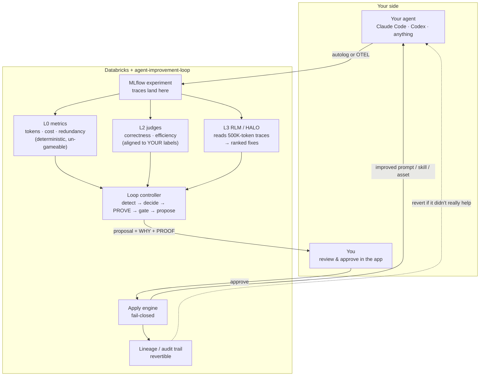
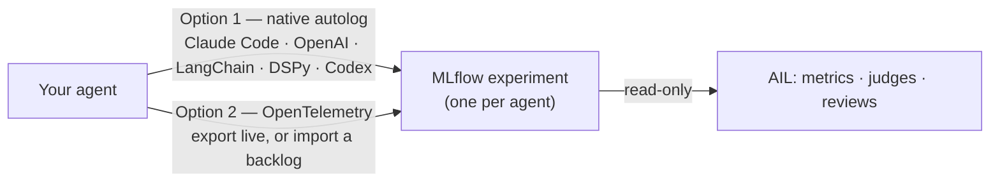
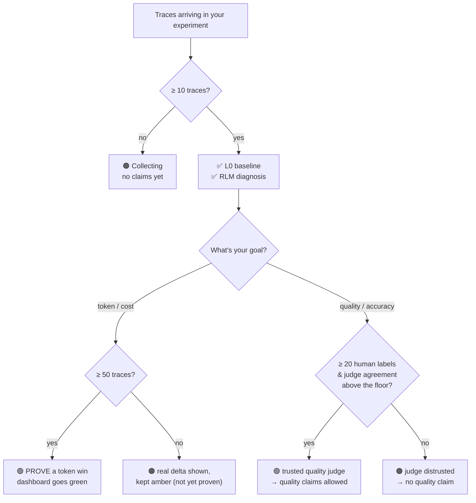
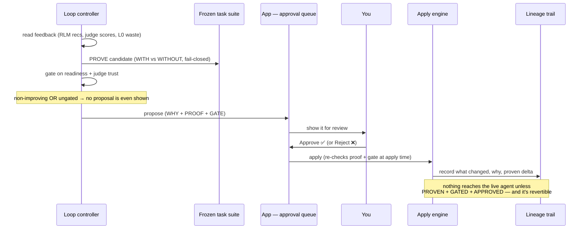

# Getting started — the visual quickstart

**Turn your agent's traces into measurable, provable, self-driven improvement —
without ever trusting a dashboard that lies.**

This is the hands-on guide. If you read nothing else, read
[§1 — the one idea](#1-the-one-idea-you-connect-you-dont-upload) and
[§2 — when it actually helps](#2-when-will-it-actually-help-the-readiness-gates).
For the full design see [`PRODUCT_ARCHITECTURE.md`](PRODUCT_ARCHITECTURE.md)
(the design of record); for the pitch see the [README](../README.md). Picking this
project up fresh or debugging a deployment? Start with
[`PROJECT_STATE.md`](PROJECT_STATE.md) — the component map, CLI reference, live
deployment details, and operational gotchas.

---

## Who this is for & what you get

You run an LLM agent — a coding agent like **Claude Code** or **Codex**, or any
other deployment — and you want it to get **cheaper, faster, or more accurate
over time**, with *evidence* that each change actually helped.

This framework watches your agent's traces, tells you where the waste and
failure modes are, **proves** a fix works on a frozen test set before anyone
trusts it, and — only with your approval — applies the fix and keeps a full
audit trail you can revert.

### The 60-second overview



Everything above the human is **autonomous**. Nothing crosses to your live agent
unless it was **proven** on a frozen test set, **passed the trust gates**, *and*
**you approved it** in the app.

---

## 1. The one idea: you *connect*, you don't *upload*

There is no "upload your agent" button, and there shouldn't be. The system can
only improve **what it can measure**, and it can only measure **what has been
traced**. So step one is always: *point the loop at the MLflow experiment your
agent logs to* (or turn on tracing so it does).



> **0 traces → 0 trustworthy optimization.** That is the foundation, not a bug.
> Until enough data exists, the loop says *"collecting — not ready yet"* instead
> of showing you a green number that isn't real.

**One experiment per agent.** Give each agent (and each multi-agent system) its
own MLflow experiment — that's how each gets its own judges and its own scoring.
The app lists all your agents in one place regardless.

New to connecting traces? **[CONNECT_YOUR_AGENT.md](CONNECT_YOUR_AGENT.md)** is
the Stage-0 walkthrough (autolog vs OTEL, and exactly how many traces you need).

---

## 2. When will it actually help? (the readiness gates)

Different goals need different amounts of data. The loop **refuses to claim
improvement until the gate for your goal is met** — and tells you exactly how
far away you are.



These are the **code-enforced defaults** (`ReadinessThresholds` in
`src/ail/readiness/compute.py`): `baseline_min_traces=10`,
`quality_min_labels=20`, `prove_min_traces=50`, `scored_coverage_floor=0.5`.

**Check where you stand with one command** (no setup beyond trace access):

```bash
ail-readiness <YOUR_EXPERIMENT_ID>
```

It prints, per gate, how many more traces / labels you need — and it never
prints a fabricated "ready."

---

## 3. Prerequisites

You do **not** need all of this on day one — L0 token/cost metrics work with
just trace access; quality and optimization layer on later.

- **Python 3.11–3.13** and this repo installed (step 4).
- A **Databricks workspace** with:
  - an **MLflow experiment** holding your agent's traces,
  - **model-serving endpoints** for judge / reflection / embedding models
    (e.g. `databricks-claude-*`, `databricks-gte-large-en`),
  - a **SQL warehouse** you have `CAN_USE` on (the UC-backed trace store reads
    traces through a warehouse — see [§9 Troubleshooting](#9-troubleshooting--operational-notes)).
- For optimization/quality: the optional `align` extra (installs `dspy`, the
  MemAlign backend) and `databricks-agents`.

---

## 4. Install

```bash
git clone https://github.com/auschoi96/agent-improvement-loop.git
cd agent-improvement-loop
python -m venv .venv && source .venv/bin/activate
pip install -e '.[dev,align]'      # 'align' pulls dspy for MemAlign; omit if you only want L0
```

Authenticate. For **interactive** use, a CLI profile is fine:

```bash
databricks auth login --profile my-workspace
```

For **long or repeated runs** (RLM batches, GEPA, alignment) use a **static
bearer matched to the workspace** — the OAuth refresh is flaky on long jobs and
the endpoint host must match the token's workspace (see [§9](#9-troubleshooting--operational-notes)):

```bash
export DATABRICKS_HOST="https://<your-workspace-host>"
export DATABRICKS_TOKEN="$(databricks auth token --profile my-workspace | jq -r .access_token)"
```

---

## 5. The first-time flow (six stages, stop after any one)

Each stage delivers value on its own. The honest order: **prove the cheap,
deterministic wins first (L0); gate every quality claim behind human ground
truth.**

### Stage 1 — Connect traces & see the L0 baseline *(no labels needed)*

L0 metrics are deterministic and un-gameable — tokens, cost, latency, tool-call
count, redundancy. This is your irrefutable baseline and it works immediately.

```bash
# Compute + publish L0 metrics from your experiment into UC Delta tables
python -m ail.publish --experiment-id <YOUR_EXPERIMENT_ID> \
    --catalog <catalog> --schema <schema>
```

- Code: [`src/ail/metrics/`](../src/ail/metrics) ([`L0_METRICS_CONTRACT.md`](L0_METRICS_CONTRACT.md))
  + `src/ail/publish.py`.
- This surfaces the heavy-token tail and repeated-target tool calls — *where the
  waste is* — which drives Stages 5 & 6.

### Stage 1b — Separate agents/cohorts with tags *(optional)*

If one experiment holds several agents, tag them so the loop treats them as
distinct cohorts with their own baselines and goals. Tag in the MLflow UI or via
[`src/ail/cohorts.py`](../src/ail/cohorts.py); search `tags.<key> = '<value>'`.
See [`COHORTS.md`](COHORTS.md).

### Stage 2 — Register LLM-judge scorers

Register the L2 judges (correctness, modularity, groundedness,
token_efficiency) as scheduled scorers on your experiment.

- Code: [`src/ail/judges/`](../src/ail/judges) ([`L2_JUDGES_CONTRACT.md`](L2_JUDGES_CONTRACT.md)).
- `list_scorers(experiment_id)` then shows them. To actually *run* on new
  traces, the experiment needs a monitoring SQL warehouse wired — the
  [deploy](DEPLOY.md) flow automates this.

### Stage 3 — Create ground truth & align judges with MemAlign *(the quality unlock)*

A judge you haven't validated against humans is **distrusted by default**. To
make a quality claim trustworthy:

1. **Label a slice of traces.** In the MLflow UI, open traces (filter by your
   cohort tag) and add human assessments named `correctness` / `modularity` /
   `groundedness` / `token_efficiency` (a 1–5 grade or pass/fail) **with a
   one-line rationale** — the rationale is what MemAlign learns from. ~15–30
   labeled traces is enough for a first alignment.
2. **Align** a judge against *your* labels (assemble disjoint pools →
   `align_judge` with the MemAlign optimizer → register). See
   [`src/ail/judges/`](../src/ail/judges).
3. **Watch judge-vs-human agreement move.** On the reference corpus this took a
   judge from **0.40 (distrusted) → 0.80 (trusted)**. Agreement is tracked with
   a floor; a drifting judge is re-distrusted. See
   [`MEMALIGN_ROLLBACK.md`](MEMALIGN_ROLLBACK.md) (it also covers the `unalign`
   rollback and which metrics suit a `{{ trace }}` judge vs. a deterministic L0
   rule).

> **Why this matters:** MemAlign aligns to *human* feedback, never to model
> output. Aligning a judge to another model's labels (e.g. the RLM's) and then
> optimizing the agent against that judge is the **co-adaptation trap** — scores
> climb while real quality stalls. The whole design exists to prevent this.

### Stage 4 — Recursive review of huge traces (RLM / HALO)

Coding-agent traces can be 500K–900K tokens — too long for a single judge call
or a human. The L3 reviewer uses HALO (a trace-specialized recursive LM) to
review them and emit a structured verdict + ranked **asset recommendations**.

```bash
AIL_LIVE_MLFLOW=1 python scripts/run_rlm_batch.py \
    --experiment-id <YOUR_EXPERIMENT_ID> --profile my-workspace
```

- Code: [`src/ail/l3/`](../src/ail/l3). The reviewer runs in its **own** trace,
  so its tokens never pollute the agent's L0 numbers; the verdict attaches to
  the subject trace as an assessment.
- Output: per-trace `rlm_*` scores + a ranked list of recommended assets (the
  input to Stage 6).

### Stage 5 — Optimize the agent prompt/skill with GEPA

GEPA evolves the agent's prompt/skill against the **train split** of the frozen
task suite; fitness is the harness's own PROMOTE decision + realized token
reduction. It **never trains on the held-out split** and **never auto-promotes**
— it produces a human-gated candidate.

```bash
AIL_LIVE_GEPA=1 python scripts/run_gepa_optimization.py \
    --suite-version phase2-mini --run-plan run_plan.yaml \
    --holdout-id <task-a> --holdout-id <task-b> \
    --reflection-lm "databricks:/databricks-claude-opus-4-8" \
    --output artifacts/gepa_candidate.json
```

- Code: [`src/ail/optimize/gepa_runner.py`](../src/ail/optimize) ([`GEPA_OPTIMIZATION.md`](GEPA_OPTIMIZATION.md)).
- Review `artifacts/gepa_candidate.json` (`changed`, held-out vs. seed) and
  promote separately if it holds up. Live GEPA runs real agent sessions per
  fitness eval — keep the budget small; it is slow and billable.

### Stage 5b — Prove an improvement (WITH vs WITHOUT, fail-closed)

Before believing any lever, run the controlled comparison on the **frozen** task
suite: baseline (no intervention) vs candidate, in isolated per-arm workspaces,
correctness gated by deterministic L1 checks.

```bash
python scripts/run_phase2_comparison.py --suite-version phase2-mini --run-plan run_plan.yaml
```

- Code: [`src/ail/compare/`](../src/ail/compare) + [`src/ail/task_suite/`](../src/ail/task_suite)
  ([`PHASE2_LIVE_HARNESS.md`](PHASE2_LIVE_HARNESS.md)).
- It **fails closed**: a crashed candidate, a failed baseline, a missing
  verifier, or a sub-threshold reduction all **BLOCK** — a token "win" off a
  broken run is never counted. On the reference suite this proved a **35.4%
  token reduction with correctness held** (2 PROMOTE / 3 honest BLOCK).
- **Build your own frozen suite first** (proving is only as meaningful as the
  suite is representative of *your* work): scaffold candidate tasks from your real
  traces and freeze them (`ail-suite-scaffold` → author a `checks.yaml` per task →
  `ail-suite-freeze`, which refuses to freeze until every task has a real
  human-authored check). Proving is **opt-in Tier-2** — run it here from the CLI,
  or per-proposal from the app's **"Verify on my suite"** button
  ([`PHASE2_FIXTURE_SPEC`](PHASE2_FIXTURE_SPEC.md)).

### Stage 6 — Generate helper assets

Turn the RLM's ranked recommendations into a real, deployable Databricks asset —
e.g. a UC **metric view** for tool-call redundancy / token efficiency built from
the *real* L0 columns (with a fabrication guard: a measure with no backing column
is dropped-with-reason, never invented).

- Code: [`src/ail/optimize/assets/`](../src/ail/optimize/assets) ([`ASSET_GENERATOR.md`](ASSET_GENERATOR.md)).

---

## 6. How a change actually reaches your agent (the human in the loop)

You chose the **autonomous-up-to-approval** model: the framework detects,
decides, proves, and proposes on its own — but a change reaches your live agent
**only when you approve it in the app**, with the evidence in front of you.



- **What actually runs this loop:** the **local companion** on deployer-controlled
  compute (the planner + executor + prover need the Claude Agent SDK, which can't
  run in a hosted app/serverless job). One command starts it:
  ```bash
  ail-companion-start                    # or: python -m ail.companion poll \
  #   --experiment <EXPERIMENT_ID> --catalog <CATALOG> --schema <SCHEMA>
  ```
  It polls UC for pending work, produces the *concrete* change in a sandbox for you
  to preview, and applies only what you approve. Subcommands:
  `python -m ail.companion {plan|execute|prove|poll|run}`
  ([`COMPANION.md`](COMPANION.md), [`EXECUTOR.md`](EXECUTOR.md)).
- Design of record: [`LOOP_CONTROLLER.md`](LOOP_CONTROLLER.md). Revert a change
  that didn't really help with `ail-revert <agent> --to-version <n>` (fail-closed,
  dry-run by default; Databricks-native — prompt-registry alias flip, UC-Volume
  snapshot restore, or `DROP` — no git needed).

---

## 7. State a goal in natural language

Rather than wiring metrics by hand, declare intent and let the goal compiler turn
it into a concrete objective + metrics + guardrails
([`src/ail/goals/`](../src/ail/goals)):

> *"Reduce my token cost 30% without hurting correctness"* → `{objective:
> total_tokens ↓30%, guardrail: correctness must not regress}`

A quality goal automatically lists its judge as a guardrail, so the readiness
wall requires that judge to be measured before it will claim a win.

---

## 8. See it in the app & deploy it

The framework ships a Databricks App (AppKit) — your single pane of glass across
all your agents: the L0 leaderboard, the baseline-vs-version comparison, the
judge-vs-human agreement trend, and the approval queue.

```bash
# from ail-self-optimizer/ — turnkey: provisions/uses a warehouse, runs app+jobs
# as ONE service principal, grants CAN_USE, sets the monitoring tag
databricks bundle deploy --profile my-workspace
databricks bundle run   app --profile my-workspace   # roll the app live
```

- App: [`ail-self-optimizer/`](../ail-self-optimizer). Full deploy sequence and
  the admin-grant caveats are in [`DEPLOY.md`](DEPLOY.md).
- **Caveat:** granting `CAN_USE` needs the deploying identity to have that
  authority (workspace admin or `MANAGE` on the warehouse). If you deploy as a
  non-privileged user, an admin runs the grant once. There is no bypass — this is
  the Databricks permission model.

---

## 9. Troubleshooting & operational notes

- **`401 / Credential ... unsupported` reading traces:** the UC-backed trace
  store serves reads through a SQL warehouse. Grant your identity `CAN_USE` on a
  warehouse and pass `--warehouse` / `DATABRICKS_*` accordingly.
- **`403 Invalid Token` on a model call:** the endpoint host must match the
  token's workspace. A token minted for workspace A 403s against workspace B even
  for the same model name. Mint the token from the **same** profile whose host
  you set in `DATABRICKS_HOST`.
- **`exit status 45` / OAuth refresh failures on long runs:** profile OAuth
  refreshes ~hourly and the in-process refresh is flaky. For long jobs use a
  **static bearer** (`DATABRICKS_HOST` + `DATABRICKS_TOKEN`) and leave `--profile`
  unset. The durable fix for deployments is the single-SP credential in
  [`DEPLOY.md`](DEPLOY.md).
- **Rate limits / region-unavailable models:** if one workspace throttles or
  lacks a model in-region, point the model flags at a workspace that serves it
  cleanly (model names resolve per-workspace).
- **Live GEPA is slow:** each fitness eval is a real agent coding session that can
  hit a per-arm timeout; if both seed and candidate score 0 (e.g. the arm times
  out), GEPA correctly declines to promote. Keep budgets small and tasks fast.
- **App build fails with `TABLE_OR_VIEW_NOT_FOUND` or a missing column** (typegen
  `DESCRIBE QUERY`): the app's tables/columns weren't ensured before the build. Run
  `ail-bootstrap-grants` first — it creates missing tables **and additively migrates
  missing columns** (`ALTER … ADD COLUMNS`, idempotent, fail-loud on a type
  conflict) *before* `bundle run app`. Upgrade deploys over an existing workspace are
  handled automatically; no manual `ALTER` is needed.
- **Cross-vendor review under gateway 429s:** if a reviewer worker (codex/GPT on the
  Databricks gateway) rate-limits, reroute it to a different workspace's gateway
  bucket (edit its base_url + auth `--profile`) or wait; `claude_code` (local auth)
  is an unthrottled fallback implementer. See [`PROJECT_STATE.md`](PROJECT_STATE.md) §7.

---

## 10. Where each stage lives (map)

| Stage | Module | Script / entry point | Contract doc |
|---|---|---|---|
| 1. Ingest + L0 | `src/ail/ingest`, `src/ail/metrics`, `src/ail/publish.py` | `python -m ail.publish` | [L0_METRICS_CONTRACT](L0_METRICS_CONTRACT.md) |
| 1b. Cohorts | `src/ail/cohorts.py` | — | [COHORTS](COHORTS.md) |
| 2. L2 judges | `src/ail/judges` | — | [L2_JUDGES_CONTRACT](L2_JUDGES_CONTRACT.md) |
| 3. Ground truth + MemAlign | `src/ail/groundtruth`, `src/ail/judges` | `scripts/demo_memalign_rollback.py` | [MEMALIGN_ROLLBACK](MEMALIGN_ROLLBACK.md), [READINESS_AND_TRUST](READINESS_AND_TRUST.md) |
| 4. RLM / HALO | `src/ail/l3` | `scripts/run_rlm_batch.py` | — |
| 5. GEPA | `src/ail/optimize/gepa_runner.py` | `scripts/run_gepa_optimization.py` | [GEPA_OPTIMIZATION](GEPA_OPTIMIZATION.md) |
| 5b. Comparison | `src/ail/compare`, `src/ail/task_suite` | `scripts/run_phase2_comparison.py` | [PHASE2_LIVE_HARNESS](PHASE2_LIVE_HARNESS.md) |
| 6. Assets | `src/ail/optimize/assets` | — | [ASSET_GENERATOR](ASSET_GENERATOR.md) |
| Goals | `src/ail/goals` | — | — |
| Readiness | `src/ail/readiness` | `ail-readiness <exp>` | [READINESS_AND_TRUST](READINESS_AND_TRUST.md) |
| Judge authoring | `src/ail/judges`, `jobs/author_judge.py` | `ail-author-judge` | [JUDGE_AUTHORING](JUDGE_AUTHORING.md) |
| Auto-align (MemAlign trigger) | `src/ail/judges`, `jobs/auto_align_job.py` | `ail-auto-align` | [AUTO_ALIGN](AUTO_ALIGN.md) |
| Suite builder | `src/ail/task_suite` | `ail-suite-scaffold`, `ail-suite-freeze` | [PHASE2_FIXTURE_SPEC](PHASE2_FIXTURE_SPEC.md) |
| Controller + approval | `src/ail/loop` | — | [LOOP_CONTROLLER](LOOP_CONTROLLER.md) |
| **Companion** (plan/execute/prove/poll) | `src/ail/companion`, `src/ail/executor` | `ail-companion-start`, `python -m ail.companion` | [COMPANION](COMPANION.md), [EXECUTOR](EXECUTOR.md) |
| Versioning + revert | `src/ail/versioning`, `publish_lineage.py`, `publish_versions.py` | `ail-revert` | [VERSIONING](VERSIONING.md), [PROMPT_REGISTRY](PROMPT_REGISTRY.md) |
| Deploy (bootstrap + migration) | `databricks.yml`, `resources/`, `ail-self-optimizer/`, `jobs/bootstrap_*.py` | `databricks bundle deploy`, `ail-bootstrap-grants` | [DEPLOY](DEPLOY.md) |

---

## 11. The trust guarantees (why it refuses to lie)

This system is built to distinguish *real* improvement from a dashboard that says
"improved." The non-negotiables, all enforced in code:

- **Frozen-eval wall** — the optimizer never trains on the held-out task suite.
- **Fail-closed everywhere** — an un-run, errored, or unverifiable evaluation is
  **never** a pass; a token win off a broken/failed run is never counted.
- **Distrusted-by-default judges** — a judge is untrusted until its agreement
  with human labels is measured above a floor.
- **Judge–agent decoupling** — judges are aligned on a separate cadence from
  agent optimization, against fresh human labels, to break co-adaptation.
- **Human-gated apply** — nothing reaches your live agent without a proven,
  gated proposal *and* your approval; every applied change is recorded and
  revertible.
- **Honest readiness** — per goal, the loop states what data is still missing and
  declines to claim improvement until the gate is met.

See [`READINESS_AND_TRUST.md`](READINESS_AND_TRUST.md) for the full risk register.
